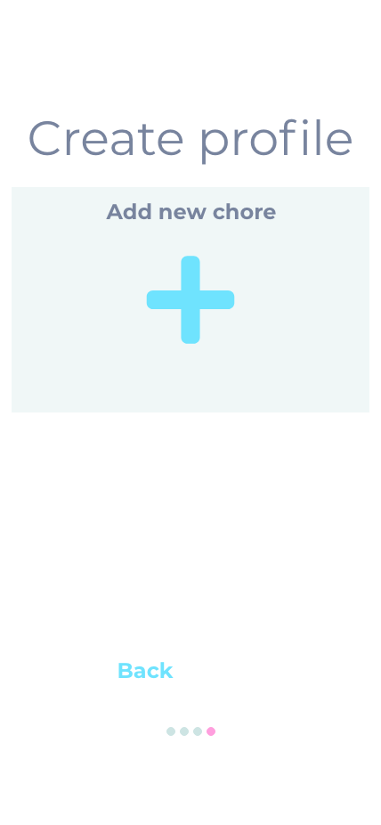
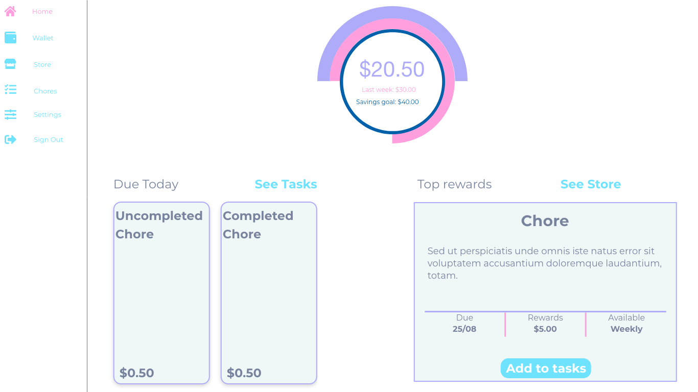

# myFamily: A Full Stack MERN Application

#### Developed by: [Abdul A Ahmad](https://www.linkedin.com/in/abdulaahmad/) | [Tayyeb Khan](https://www.linkedin.com/in/tayyebkhan93/) | Assignment T3A2-A

#### [Link To The Github Repository](https://github.com/AbdulAAhmad/T3A2)

---

## Description of our website

Our application will be designed around chores for children, managed by parents. The parent/s will set up an account that their children or family members can join. The parent will be able to add and create chores that will have a the option of a dollar value amount associated with it or a point system. This will then allow the kids to do as many chores as they would like showing them their weekly allowance pay out.

---

## Purpose

The purpose around this app is to allow a more manageable and incentivised way of doing chores in the household as well as preparring future generations for the real world. Using the weekly allowance system we all grew up with, tied in with hard work and a goal to achieve.

---

## Target audience

The target audience of this application is to attract parents who wish to teach their young children the value of money in the real world up until but not limited to adolescence. A simple design that allows all demographics of an older age ease of use and protected well enough that their children cannot change their allowance if they get into the application without approval. All this will add to the user experience as well as conveniance.

---

## Functionality / Features

As this is an application that involves children, a feature we have included is that parents during sign up will be made aware in the T&C's that only their information will be stored and that the parents themselves will manage there own family.

Click to expand

Both children and parents on all devices will have access to these functions.

- Home Page
- Wallet/Earnings
- Savings Goal
- Store(optional chores)
- Tasks currently assigned
- Settings
- Sign out

Additional features we have added for parents

- Account setup
- Pin generator to allow access to family memebers
- Profiles
- Assign Tasks
- Create Store items(optional chores)

---

## Tech stack

Click to expand

**Frontend**

- React.js
- Redux
- JavaScript
- HTML
- CSS

**Backend**

- Node
- Express
- MongoDB

**Testing**

- Jest
- Cypress

**Source Control**

- Git
- Github

**Documentation and Planning**

- Github Projects
- Discord

---

## Dataflow Diagram

Click to expand

---

## Application Architecture diagram

Click to expand

---

## User Stories

#### Personae

Click to expand

##### John

John is a business owner and father of 3 kids. John was raised with the notion of hard work will earn you money. He finds that he would like to raise his kids with the same values he grew up with. John is 45 years old and isn't a very technical person. He is aware that present day practices are different from his time but still values his upbringing.

##### Tim

Tim is saving up for a Playstation, him and his brothers are all into competitive play. Tim is a goal orientated person and is having trouble on how to manage his allowance towards saving for his Playstation. Also, Tim would love to be able to reach his goal quicker, and be incentivised to compete with his brothers.

#### User Stories

Click to expand

##### Users who are administrators

- As a parent(admin):
  - I want to be able to log in, to ensure security is not breached.
  - I want to be able to add new chores whenever I want with a value of my choosing and date.
  - I want to be able to edit or delete chores I have added, so that I may correct any errors.
  - I want to be able to assign chores to members.
  - I want to be able to log out, to ensure no-one else in the family is able to add, delete or edit chores.
  - I want to be able to reset my password, in the case of forgetting or want/need it changed.
  - I want to be able to add, edit, delete new chores that are optional.

##### Users who are members of the general public

- As a member(user):
  - I want to be able to log in.
  - I want to be able to view all my chores that need to be done in one place.
  - I want to be able to see my chores being completed.
  - I want to be able to choose more optional chores to do.
  - I want to be able to see my overall earnings for the week.
  - I want to be able to compare my results with other members.
  - I want to be able to see the goal I am working towards.
  - I want to be able to log out and be able to change my password.

##### John

- As a father raising kids:
  - I want to have an easily accessible chore management app, so I can teach my children the value of money in the real world.
  - I want to be sure that my chores added is always consistent and correct, so that I can ensure I am providing accurate tasks to my children.
  - I want to have a way to reset my password when I forget what I set it to.
  - I want the application to be easy, simple and intuitive to use from the get go.

##### Tim

- As a teenager with siblings:
  - I want to be able to see how much I have saved towards my goals set by me.
  - I want to be able to compare my results with my siblings.
  - I want to be able to speed up reaching my goal by getting more chores to do.

---

## Wireframes for multiple standard screen sizes, created using industry standard software

### Mobile Wireframes

#### User Authentication

 

Click to expand

 

#### Profile Creation

Click to expand

#### Parent Screens

Click to expand

#### Child Screens

Click to expand

### Desktop/Tablet Wireframes

#### User Authentication

Click to expand

#### Profile Creation

Click to expand

#### Parent Screens

Click to expand

#### Child Screens

Click to expand

---

## Planning and Documentation Methodology

Click to expand

[Link to GitHub Projects](https://github.com/AbdulAAhmad/T3A2/projects/1)

Screen shots throughout the **Development of Planning**

| Weeks  | Days      | Screen shots            |
| ------ | --------- | ----------------------- |
| Week 1 | Day 1     |  |
|        | Day 2     |  |
|        | Day 3     |  |
| Week 2 | Day 1     |  |
|        | Day 2     |  |
|        | Day 3     |  |
| Week 3 | Day 1 - 3 |             |

